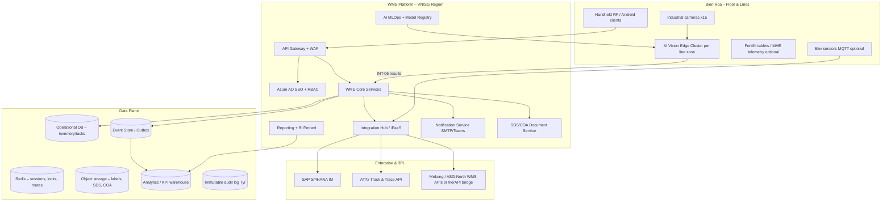
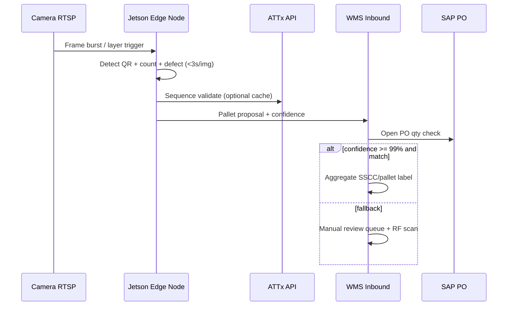
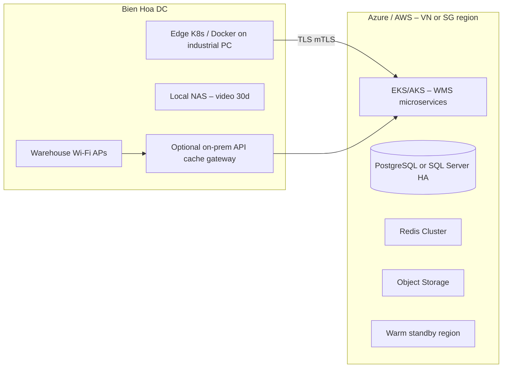

Below is an architecture proposal grounded in `Syngenta_WMS_AI_System_Specification_EN.md`, aligned with your existing AI Vision operational notes and phased roadmap (Phase 1 go-live Mar 2027, Phase 2 MCF + automated SAP posting).

---

## 1. Architectural principles

| Principle | Rationale (from spec) |
|-----------|------------------------|
| **API-first, modular microservices** | Independent upgrades; 1-week warehouse onboarding via config |
| **Hybrid edge–cloud for AI** | 30s pallet cycle, 13 lines peak, video stays in Vietnam ≤30 days |
| **Integration hub as first-class product** | INT-01–12, heartbeat, 90-day logs, OAuth2/cert |
| **Execution truth in WMS, financial truth in SAP** | Phase 1: WMS confirms picking; PGI manual in SAP; Phase 2: INT-04 |
| **Offline-first floor apps** | 30 min cache, 5 min reconcile, 20+ scanners |
| **Compliance by design** | Hazard matrix, GHS labels, chemical registers, 7-year audit |
| **Parameter-driven multi-site** | Bien Hoa + Mekong + ASG-North without code forks |

---

## 2. Reference logical architecture (recommended baseline)

> **Component reference:** For a detailed explanation of each entity in the diagram below — roles, interfaces, benefits, and rationale vs. alternatives — see [`component_reference.md`](component_reference.md) (EN) · [`component_reference_vn.md`](component_reference_vn.md) (VI).



### 2.1 WMS Core — service decomposition (maps to modules A–I)

| Bounded context | Responsibilities | Key NFR hooks |
|-----------------|------------------|---------------|
| **Inbound** | Production AI receipt, consolidation labels, import/vendor/revert, manual queue | &lt;3s P95 updates; fallback queue |
| **Inventory & Location** | Bin-level stock, digital map, adjustments | Real-time qty; cycle count |
| **Slotting & Tasking** | Put-away/pick tasks, route graphs, MHE assignment | Shortest-path; hazard blocks |
| **Outbound** | SO/DN tasks, GPD scan, multi-level pallet/case, exceptions | INT-03 &lt;5s; Phase 1 manual PGI flag |
| **Compliance & Safety** | Hazard matrix, GHS label data, chemical limits, SDS link | Block put-away; regulatory exports |
| **QA & Hold** | Quality hold/release, MRL/COA checks, recall trace | Approval workflows |
| **3PL Billing** | Rate cards, utilization, invoice reconcile | &gt;2% variance workflow |
| **Labor & MHE** | Shifts, roster, equipment hours, PM alerts | Bien Hoa only |
| **Master Data** | Materials, zones, BOM refs (read-through SAP) | No-code config UI |
| **Reporting API** | KPI feeds, scheduled jobs | Real-time dashboards |
| **MCF (Phase 2)** | GR auto-post, PM scan vs BOM, bulk tanks, yield, line clearance | INT-02/04; &lt;30s GR |

Services communicate via **domain events** (e.g. `PalletVerified`, `PickConfirmed`, `PutawayBlockedByHazard`) persisted in an **outbox** for reliable SAP/ATTx delivery.

### 2.2 Integration Hub (INT matrix implementation)

Treat integrations as a dedicated **Integration Platform** (not ad-hoc calls from each service):

```
┌─────────────────────────────────────────────────────────────┐
│ Integration Hub                                            │
│  • Connector: SAP (RFC primary + OData/REST where available) │
│  • Connector: ATTx (REST, OAuth2)                            │
│  • Connector: 3PL (REST/API or scheduled SFTP+validation)  │
│  • Scheduler: 15-min delta + nightly full (INT-01)           │
│  • Real-time consumer: SO/DN (INT-03), PO (INT-02 Phase 2)  │
│  • Publisher: PGI, movements, GR (INT-04 Phase 2)            │
│  • Health: heartbeat 5 min, alert 15 min loss                │
│  • Store: 90-day message log, replay, idempotency keys       │
└─────────────────────────────────────────────────────────────┘
```

**SAP connectivity (Proposal A – enterprise standard):** SAP Process Orchestration / CPI **or** SAP BTP Integration Suite as middleware, with RFC adapters to S/4 and IDoc for PGI (Phase 2). WMS never holds SAP credentials on handhelds.

**SAP connectivity (Proposal B – lean):** Dedicated **SAP Integration Service** (.NET/Java) using `SAP.NCo` / SAP Cloud SDK, connection pooling, circuit breaker, stored in same K8s cluster as WMS.

Both satisfy evaluation criterion #2; A reduces custom RFC risk, B lowers license TCO.

### 2.3 AI Vision Platform (hybrid edge–cloud)



| Layer | Components | Spec alignment |
|-------|------------|----------------|
| **Edge (per line or zone)** | NVIDIA Jetson AGX Orin, GStreamer/DeepStream pipeline, TensorRT YOLO + dedicated QR decoder, local Redis buffer | 30s pallet SLA; offline if cloud down |
| **Line orchestration** | Layer-by-layer triggers + ATTx sequence inference (your `AI_Vision_Operational_Flow.md`) | Manual vs robot line POC |
| **Cloud MLOps** | Labeling (CVAT), training pipeline, model registry, quarterly retrain, Grad-CAM export | Eval criterion #1, escrow weights |
| **Governance** | Video retention 30 days local NAS only; metadata-only northbound | Data residency |

**Camera placement strategy:** Robot lines (KL): fixed overhead + side NIR; manual lines: dual-angle + structured light, layer scan at stack station—not only “finished pallet” shot.

---

## 3. Deployment topology (physical + cloud)



| Tier | Recommendation |
|------|----------------|
| **Primary compute** | Managed Kubernetes (AKS in Southeast Asia) — matches Azure AD SSO |
| **DB** | PostgreSQL 15+ with Patroni/Citus or Azure SQL — HA sync replica in second AZ |
| **DR** | Active-passive: RPO &lt;1h via continuous WAL + 4h transaction backups; RTO &lt;4h runbook |
| **Uptime 99.9% (06:00–22:00)** | Auto-scale HPA on API; exclude maintenance windows; health-based traffic shift |
| **Edge** | 2–3 Jetson nodes per 4-line group + hot spare; line-local API if WAN blip affects only cloud dashboards, not counting |

**3PL sites:** No full WMS redeploy—deploy **3PL Adapter Service** + lightweight **sync agent** (API pull/push or nightly + event webhooks) into central WMS for billing and inventory visibility.

---

## 4. Data architecture

| Store | Contents | Retention |
|-------|----------|-----------|
| **Operational OLTP** | Inventory, locations, tasks, scans, holds | Active + backups |
| **Event/outbox** | Integration messages, domain events | 90 days hot, archive 7 years audit subset |
| **Audit ledger** | Who/when/before/after for every stock mutation | 7 years immutable (append-only table or WORM storage) |
| **Trace graph** | Batch lineage production → pallet → shipment | Recall readiness |
| **Analytics** | KPI aggregates, AI accuracy by line | Real-time via CDC → DWH |
| **Documents** | SDS PDF, COA OCR results | Versioned; SDS expiry alerts |

**Inventory model:** `Warehouse → Zone → Location (bin) → License Plate (pallet) → Handling Unit (case) → Serial (ATTx)` with status dimensions (available, hold, QA, blocked-hazard).

**Conflict resolution (offline sync):** Optimistic concurrency with `version` + `device_id` + server-side **merge rules** (last-writer-wins only for non-stock fields; stock moves require server reconciliation queue).

---

## 5. Floor & IoT layer

| Device | Protocol | Function |
|--------|----------|----------|
| **RF guns / rugged Android** | HTTPS + local SQLite queue | All scan workflows; Vietnamese UI |
| **Label printers** | ZPL over Wi-Fi/USB gateway | Pallet/case labels with GHS pictograms |
| **Industrial cameras** | RTSP → edge | AI Vision INT-05 |
| **Env sensors (optional)** | MQTT → IoT broker → WMS | QA alerts INT-09 |
| **MHE telematics (optional)** | CAN/OBD gateway or manual hour login | Module E forklift hours |

**Offline pattern:** Mobile BFF with **sync engine**—operations append to outbox; on reconnect, server processes in order with idempotency keys (`scanId`, `taskId`).

---

## 6. Security & governance architecture

```
Users → Azure AD (SSO + MFA Admin) → App Gateway → JWT
       → RBAC policy engine (OPA/Casbin or embedded)
       → Service accounts (integration) via managed identity
Data: AES-256 at rest (TDE + blob SSE), TLS 1.2+ everywhere
Secrets: Azure Key Vault / HashiCorp Vault
Network: Private link to SAP; edge cameras on VLAN isolated from corporate
```

Four roles map 1:1 to policy bundles; **supervisor overrides** require dual control + audit reason codes.

---

## 7. Phase 1 vs Phase 2 feature flags

| Capability | Phase 1 | Phase 2 |
|------------|---------|---------|
| WMS execution (inbound/outbound/storage) | ✓ | ✓ |
| AI Vision + pallet label | ✓ | ✓ |
| INT-01, INT-03, INT-05/06/10/12 | ✓ | ✓ |
| PGI to SAP | Manual in SAP | INT-04 automated |
| MCF GR, PM, bulk, yield, line clearance | — | INT-02, MCF modules |
| Feature flags in **Integration Hub** | `auto_pgi=false`, `auto_gr=false` | Enable per written activation |

This avoids re-architecture at Phase 2—only connectors and workflow automation deepen.

---

## 8. Alternative architecture proposals (for committee scoring)

### Proposal 1 — **Cloud-native custom WMS** (recommended for eval scores 1, 3, 6)

- Custom microservices on AKS + SAP CPI + edge AI you own
- **Pros:** Full hazard/FEFO/slotting control; no WMS vendor lock-in; escrow friendly
- **Cons:** Highest build effort; needs strong SAP + CV team

### Proposal 2 — **Composable: extended commercial WMS + custom compliance/AI layer**

- Base: Manhattan Active / Blue Yonder / Infor WMS (cloud) + **custom Syngenta extensions** for hazard matrix, Vietnam regulatory, AI inbound, 3PL billing
- **Pros:** Faster outbound/picking baseline; lower core WMS risk
- **Cons:** Extension model limits; TCO licenses; AI escrow still custom

### Proposal 3 — **Event-driven enterprise mesh**

- Same as Proposal 1 but **Kafka/Event Hubs** as backbone; CQRS read models for dashboards
- **Pros:** Real-time KPI, clean 3PL/SAP decoupling, replay for billing disputes
- **Cons:** Ops complexity; overkill if team &lt;15 engineers—use **only if** reporting SLA becomes bottleneck

### Proposal 4 — **Maximum edge autonomy**

- Edge runs **mini-WMS slice** (inbound verify + label print) when cloud unreachable; cloud is system of record
- **Pros:** Protects 13-line throughput during outages
- **Cons:** Edge state reconciliation complexity—justify only if Bien Hoa WAN is historically unstable

---

## 9. Non-functional requirements traceability

| NFR | Architectural mechanism |
|-----|---------------------------|
| P95 &lt;3s updates | Redis cache for master data; async writes for non-critical paths; DB indexing on `location_id`, `lpn` |
| ≥50 concurrent users | API horizontal scale; connection pool sizing; CDN for static admin UI |
| AI ≤30s/pallet | Parallel multi-face inference; layer pipeline; pre-warmed TensorRT engines |
| SAP events &lt;5s | Dedicated INT-03 consumer; no batch path for SO/DN |
| ≥20 scanners | Mobile BFF; WebSocket optional for task push |
| 99.9% uptime 06–22 | Multi-AZ; pod disruption budgets; exclude edge from cloud SLA where local queue applies |
| RTO &lt;4h / RPO &lt;1h | HA DB + 4h incremental backup + DR playbook |
| Offline 30m / sync 5m | SQLite outbox + ordered replay + idempotency |
| VN/SG residency | Region-locked storage; no cross-border video |
| 7-year audit | Partitioned audit store + legal hold |

---

## 10. Technology stack (illustrative, current-gen)

| Layer | Option A (Microsoft-aligned) | Option B (cloud-neutral) |
|-------|------------------------------|---------------------------|
| API | ASP.NET Core 8 / minimal APIs | Java Spring Boot 3 |
| Mobile | .NET MAUI or React Native + offline SQLite | Same |
| Workflow | Temporal.io or Camunda for approvals/recount | Same |
| Integration | Azure Logic Apps + SAP CPI | Apache Camel + NCo |
| AI edge | DeepStream + TensorRT YOLOv8 + ZXing/Quirc | Same |
| AI train | Azure ML or Kubeflow on GPU pool | Same |
| DB | Azure PostgreSQL Flexible | RDS/Aurora PostgreSQL |
| BI | Power BI Embedded + Excel export jobs | Metabase + Superset |
| IoT | Azure IoT Hub MQTT | EMQX self-hosted |

Given **Azure AD SSO** in the spec, Option A reduces identity friction.

---

## 11. Reporting & dashboards (Module F)

- **Operational plane:** Real-time KPI via CDC from OLTP → **read replica** or stream processor (inventory accuracy, FEFO compliance, AI line accuracy).
- **Semantic layer:** Metrics definitions as code (dbt) so Excel/PDF schedules stay consistent.
- **Embedded BI:** Power BI or Metabase for drag-and-drop; **responsive** supervisor views for 10" tablets.
- **Distribution:** Notification service renders templates → SMTP (INT-12); variance approvals deep-link to workflow UI.

---

## 12. Implementation sequencing (architecture-driven)

| Wave | Deliverables |
|------|----------------|
| **Q3–Q4 2026** | Integration Hub skeleton, SAP MD sync (INT-01), master data UI, digital warehouse map, hazard matrix POC |
| **Q4 2026–Q1 2027** | AI POC on manual lines, edge pipeline, inbound + fallback, outbound INT-03, RF offline, Phase 1 go-live |
| **Q2–Q3 2027** | MCF services, INT-02/04, automated GR/PGI, PM BOM gate, yield alerts |

---

## 13. Risks and mitigations (architecture-level)

| Risk | Mitigation |
|------|------------|
| Manual line AI &lt;99% | Layer scan + ATTx inference; mandatory POC gate; manual queue never blocks line |
| SAP RFC latency | Async confirmation UX; outbox retry; don’t block scan on SAP round-trip |
| 3PL data quality | Adapter validation layer; billing on WMS-computed truth with dispute workflow |
| Chemical compliance errors | Rule engine versioned with effective dates; block > warn for incompatibles |
| Vendor lock-in (AI) | Exportable ONNX/TensorRT + training scripts in escrow |

---

## 14. Summary recommendation

For Syngenta’s evaluation weights, the **strongest balanced choice** is **Proposal 1 (cloud-native custom WMS on Kubernetes in VN/SG) + dedicated Integration Hub + hybrid AI Vision edge cluster**, with:

1. **Clear bounded contexts** per module A–I and Phase 2 MCF as additive services behind feature flags.  
2. **SAP/ATTx/3PL** isolated in Integration Hub with outbox, idempotency, and health monitoring.  
3. **Edge-first AI** with layer-by-layer and ATTx cross-check (per your operational flow doc).  
4. **Offline-first mobile** and **compliance/audit** as non-negotiable platform capabilities, not add-ons.  
5. **Reporting** fed by event/CDN stream for real-time KPI without hammering OLTP.

If you want a follow-up, I can drill into one area only—for example SAP IDoc/RFC message catalog, hazard-matrix rule engine design, or a detailed microservice API map per module—still in Ask mode as guidance only. For diagrams committed into `docs/`, switch to Agent mode.