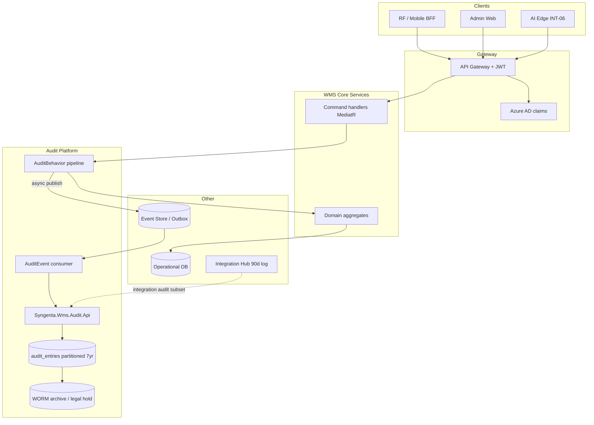

Based on `architectural.md`, `component_reference.md`, and `proposed_project_structure.md`, here is a concrete audit-logging solution aligned with the proposed architecture.

## Design goal

Meet the RFP requirement: **Who / When / What action / Before–after values** for every inventory and configuration change, retained **7 years**, **immutable**, separate from mutable OLTP data.

The architecture already positions this as a **first-class platform capability**, not a per-service afterthought:

- Dedicated **AUDIT** store in the data plane
- Dedicated **`Syngenta.Wms.Audit`** horizontal service
- Cross-cutting **MediatR audit behavior** in shared application layer
- Dual write on critical paths: `OLTP + AUDIT` (outbound pick, supervisor overrides)

---

## 1. High-level architecture



**Principle:** Business services own **execution truth** (OLTP). The Audit service owns **evidence truth** (append-only ledger). They are written in the **same transaction boundary** where possible, or via **outbox** when async is required.

---

## 2. What to record (audit taxonomy)

| Category | Examples | Mandatory fields |
|----------|----------|------------------|
| **Stock mutations** | Receipt, put-away, pick, move, adjustment, cycle count | `warehouse_id`, `lpn`/`location_id`, `material`, `batch`, `qty_before`, `qty_after` |
| **Status changes** | Hold/release, QA block, hazard block | `entity_id`, `status_before`, `status_after`, `rule_version` |
| **Privileged overrides** | Supervisor hazard override, variance approval, recount sign-off | `reason_code`, `approver_id`, optional `second_approver_id` (dual control) |
| **Master data / config** | Hazard matrix, zone rules, rate cards | `config_key`, `effective_date`, JSON diff |
| **Compliance** | SDS version update, incident log, GHS label reprint | `document_id`, `version`, regulatory context |
| **Integration (subset)** | SAP PGI, GR, SO/DN sync outcomes | `correlation_id`, `idempotency_key`, `external_ref` — promoted from Hub 90-day log to 7-year audit subset when stock-impacting |
| **Floor / offline** | RF scan replay after reconnect | `device_id`, `client_timestamp`, `server_timestamp`, `scan_id` |

**Do not audit:** read-only queries, dashboard views, cached master-data reads.

---

## 3. Capture mechanisms (three layers)

### Layer A — MediatR `AuditBehavior` (primary, in every Core service)

As proposed in `proposed_project_structure.md`, register a pipeline behavior before/after command handlers:

```csharp
// Conceptual flow — Syngenta.Wms.Application/Behaviors/AuditBehavior.cs
public class AuditBehavior<TRequest, TResponse> : IPipelineBehavior<TRequest, TResponse>
    where TRequest : IAuditableCommand
{
    public async Task<TResponse> Handle(...)
    {
        var ctx = _auditContext.FromHttpContext(); // userId, roles, warehouse, deviceId, correlationId
        var before = await _snapshotProvider.CaptureAsync(request); // only for mutating commands

        var response = await next();

        var entry = AuditEntry.Create(
            actor: ctx,
            action: request.AuditAction,          // e.g. "PickConfirmed"
            entityType: request.EntityType,
            entityId: request.EntityId,
            before: before,
            after: await _snapshotProvider.CaptureAsync(request),
            reasonCode: request.ReasonCode);      // required for overrides

        await _auditPublisher.PublishAsync(entry); // outbox in same DB transaction
        return response;
    }
}
```

Mark commands with `IAuditableCommand` (or an attribute like `[Auditable("PickConfirmed")]`). This keeps audit logic **out of** individual handlers and matches the modular microservice layout.

### Layer B — EF Core `SaveChangesInterceptor` (safety net)

For entities that must never change without a trail (`InventoryBalance`, `LicensePlate`, `HoldRecord`), add an interceptor in `Syngenta.Wms.Infrastructure/Persistence` that detects `Modified`/`Deleted` rows and emits audit entries. Use this as a **backstop**, not the main path — domain commands should still express business intent (`PickConfirmed` is clearer than `UPDATE inventory SET qty = ...`).

### Layer C — Domain event consumer (async enrichment)

Domain events (`PalletVerified`, `PutawayBlockedByHazard`, `PickConfirmed`) already go to the **Event Store / Outbox**. An `AuditEventConsumer` in `Syngenta.Wms.Audit` subscribes and writes audit rows when:

- The event is compliance-critical but wasn't captured synchronously (e.g. hazard block without a user command)
- Integration Hub replays a message and stock state changes

Per `architectural.md` §4: event store is **90 days hot**, with an **audit subset archived 7 years** — this consumer is that bridge.

---

## 4. Audit entry schema (immutable)

Dedicated PostgreSQL database `wms_audit` (not co-mingled with OLTP):

```sql
CREATE TABLE audit_entries (
    audit_id          UUID PRIMARY KEY DEFAULT gen_random_uuid(),
    occurred_at_utc   TIMESTAMPTZ NOT NULL DEFAULT now(),
    client_occurred_at TIMESTAMPTZ,           -- offline device time
    warehouse_id      VARCHAR(16) NOT NULL,
    correlation_id    UUID NOT NULL,          -- ties request + integration + workflow

    actor_type        VARCHAR(16) NOT NULL,   -- User | ServiceAccount | Device | System
    actor_id          VARCHAR(128) NOT NULL,  -- Azure AD oid or managed identity
    actor_roles       TEXT[],
    device_id         VARCHAR(64),

    action            VARCHAR(64) NOT NULL,   -- PickConfirmed, HazardOverride, SdsVersionUpdated
    entity_type       VARCHAR(64) NOT NULL,
    entity_id         VARCHAR(128) NOT NULL,

    before_state      JSONB,
    after_state       JSONB,
    delta             JSONB GENERATED ALWAYS AS (...) STORED,  -- optional computed diff

    reason_code       VARCHAR(32),            -- required for overrides
    second_approver_id VARCHAR(128),          -- dual control
    source_service    VARCHAR(64) NOT NULL,     -- Outbound, Compliance, IntegrationHub
    source_command    VARCHAR(128),

    legal_hold        BOOLEAN NOT NULL DEFAULT false,
    partition_month   DATE NOT NULL           -- for 7-year partitioning
);

-- Append-only: revoke UPDATE/DELETE from app role; only INSERT allowed
-- Monthly partitions; detach + archive to WORM blob after 13 months hot
```

**Immutability enforcement:**

- DB role `wms_audit_writer`: `INSERT` only
- No `UPDATE`/`DELETE` on `audit_entries` for application accounts
- Optional: Azure Blob immutable storage tier for partitions older than 1 year
- **Legal hold** flag prevents partition purge during investigations

---

## 5. Write paths by scenario

### 5.1 Normal RF scan → stock change (Module C)

Matches `component_reference.md` §5.2:

```
RF scan (INT-10) → Gateway (JWT) → Outbound handler
  → OLTP: update pick task + inventory (same transaction)
  → Outbox: AuditEntry + PickConfirmed domain event
  → Audit consumer persists to AUDIT store
```

Use **outbox-in-OLTP-DB** pattern so you never get stock committed without a corresponding audit message (at-least-once delivery; audit service dedupes on `correlation_id + action + entity_id`).

### 5.2 Supervisor override (Module B + I)

Matches §5.3 — **Workflow + AUDIT**:

```
Supervisor submits override with reason_code
  → Workflow service (Temporal / Durable Functions) validates RBAC + optional dual approval
  → On approval: Compliance service executes override command
  → AuditBehavior writes entry with reason_code, approver_id, second_approver_id
```

Overrides must **fail** if `reason_code` is null (enforced in `AuditBehavior` + domain validator).

### 5.3 Offline mobile (30 min cache, 5 min sync)

Per `architectural.md` §5 and §4 conflict resolution:

1. Client appends scan to **SQLite outbox** with `scanId` (idempotency key), `device_id`, `client_timestamp`.
2. On reconnect, Mobile BFF replays in order.
3. Server processes command; audit entry gets:
   - `actor_id` = operator from JWT at sync time (or embedded signed token from offline session)
   - `client_occurred_at` = when operator actually scanned
   - `occurred_at_utc` = server acceptance time
   - `correlation_id` = `scanId`

This preserves **who did what on the floor** even when the network was down.

### 5.4 Integration Hub (SAP / ATTx / 3PL)

Integration Hub keeps its own **90-day message log** (replay, idempotency). For stock-impacting messages (INT-03 SO/DN, Phase 2 INT-04 PGI/GR):

- Hub publishes `IntegrationMessageProcessed` with payload hash + result
- Audit consumer writes a **subset entry** linked via `correlation_id`
- Do **not** duplicate full SAP payloads in audit — store reference + hash; full message stays in Hub log for 90 days

### 5.5 AI Vision inbound (INT-06)

Edge sends proposal + confidence. Audit:

- `action`: `PalletProposalAccepted` | `PalletManualReviewQueued`
- `actor_id`: `System` or operator if manual review
- `before_state` / `after_state`: pallet aggregate snapshot (SSCC, qty, confidence, line_id)
- No raw video in audit — metadata only (video stays local NAS ≤30 days per spec)

---

## 6. `Syngenta.Wms.Audit` service responsibilities

| API | Purpose |
|-----|---------|
| `POST /internal/audit/entries` | Called only by service bus / internal mesh (not public) |
| `GET /audit/entries` | Admin/supervisor search — filters by warehouse, entity, actor, date range |
| `GET /audit/entries/{id}` | Detail for investigations |
| `POST /audit/legal-hold` | Admin: flag entries/partitions non-purgeable |

**Read path:** Compliance and Module F reporting query Audit API or a **read replica** — never scan OLTP for audit history.

**Implementation order** (from `proposed_project_structure.md` Wave 1): build `platform/Syngenta.Wms.Audit` before domain services so every new command is auditable from day one.

---

## 7. Security and context propagation

From `architectural.md` §6:

```
Azure AD JWT → API Gateway → inject claims into AuditContext:
  - sub / oid (user ID)
  - roles (Administrator, Supervisor, Operator, View-only)
  - warehouse_id (from token or header)
  - device_id (from Mobile BFF)
  - correlation_id (from trace / X-Correlation-Id)
```

Service-to-service calls (Integration Hub, Workflow) use **managed identity** with `actor_type = ServiceAccount`. Edge AI uses a dedicated service principal, not operator credentials.

---

## 8. Retention, backup, and legal hold

| Mechanism | Implementation |
|-----------|----------------|
| **7-year retention** | Monthly partitions; auto-create 84+ months ahead |
| **Hot vs archive** | Last 13 months in PostgreSQL; older partitions exported to immutable Blob + catalog index |
| **Backup** | Audit DB included in 4-hour incremental + daily full (separate from OLTP per NFR) |
| **Legal hold** | Partition-level hold flag; purge job skips held months |
| **DR** | Audit DB replicated to secondary AZ/region; RPO <1h aligned with WAL streaming |

---

## 9. What not to conflate

| Store | Role | Retention |
|-------|------|-----------|
| **AUDIT ledger** | Regulatory evidence, stock mutation who/when/before/after | 7 years |
| **Event Store / Outbox** | Integration + domain events, replay | 90 days hot, audit subset archived |
| **Integration Hub log** | Message-level SAP/ATTx/3PL trace | 90 days |
| **Application Insights** | Ops telemetry, P95 latency | Short-term ops, not compliance evidence |

Application logs are **not** a substitute for the audit ledger.

---

## 10. Recommended implementation sequence

1. **Wave 1 (platform):** `AuditEntry` domain model, `IAuditPublisher`, outbox table, `Syngenta.Wms.Audit` API, partitioned DB, append-only permissions.
2. **Wave 1 (shared):** `AuditBehavior`, `AuditContext` middleware, `[Auditable]` command marker, reason-code validation for overrides.
3. **Per service:** Mark all mutating commands `IAuditableCommand`; define snapshot providers per aggregate.
4. **Workflow integration:** Dual-control overrides write audit only after approval step completes.
5. **Mobile BFF:** Propagate `scanId`, `device_id`, `client_timestamp` into audit context.
6. **Integration Hub:** Emit stock-impacting subset events to audit consumer.
7. **Module F:** Read-only audit search widgets for supervisors; export for regulatory inspections.

---

## 11. Example audit record (outbound pick)

```json
{
  "audit_id": "…",
  "occurred_at_utc": "2027-03-15T08:42:11Z",
  "warehouse_id": "BH01",
  "correlation_id": "scan-9f3a…",
  "actor_type": "User",
  "actor_id": "aad-oid-operator-123",
  "actor_roles": ["Operator"],
  "device_id": "RF-07",
  "action": "PickConfirmed",
  "entity_type": "PickTask",
  "entity_id": "PT-88421",
  "before_state": { "qty_picked": 40, "status": "InProgress", "location": "A-12-03" },
  "after_state": { "qty_picked": 48, "status": "Complete", "location": "A-12-03" },
  "source_service": "Outbound",
  "source_command": "ConfirmPickCommand"
}
```

---

## Summary

The architecture’s audit solution is: **capture at the command boundary** (MediatR `AuditBehavior`), **persist in a dedicated immutable store** (`Syngenta.Wms.Audit` + partitioned PostgreSQL/WORM), **relate to business and integration flows** via `correlation_id`, and **treat overrides and offline replay as first-class** with reason codes and device timestamps. Domain events and Integration Hub logs feed a **7-year audit subset** without replacing the primary ledger.

If you want to go deeper next, I can outline the exact `IAuditableCommand` contract, the outbox transaction pattern, or audit query APIs for Module I (SDS/hold/release) — still in Ask mode as design guidance only. Switch to Agent mode if you want this written into `docs/Architectural/` as a new design doc.