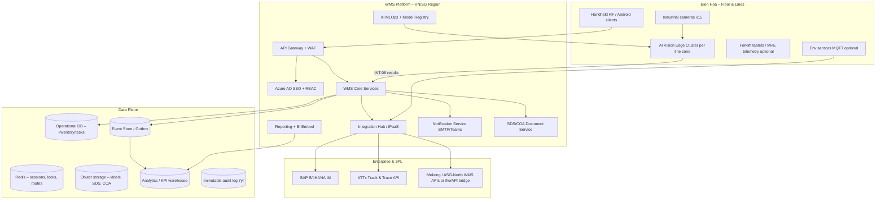

# Architecture Component Reference

> **Vietnamese version:** [`component_reference_vn.md`](component_reference_vn.md)

## Purpose of this document

This document explains **every entity** in the reference logical architecture defined in [`architectural.md`](architectural.md) (Section 2). It is written for stakeholders, solution architects, and implementation teams who need to understand:

- **What each component does** and which requirements it satisfies
- **How components interact** across the floor, platform, data, and external layers
- **Why this design was chosen** over common alternatives
- **What benefits** the layered, hybrid architecture delivers for Syngenta Vietnam

The design implements **Option A (Microsoft-aligned)**: cloud-native WMS on Azure Kubernetes Service (AKS), hybrid edge–cloud AI Vision, and a dedicated Integration Hub — as described in the [System Specification](../Syngenta_WMS_AI_System_Specification_EN.md) and the [proposed project structure](proposed_project_structure.md).

---

## Architecture at a glance

The system is organized into four cooperating layers. Each layer has a distinct responsibility; together they replace the AS-IS fragmentation (SAP, ATTx, and 3PL WMS operating in isolation with manual warehouse execution).



| Layer | Primary role | Resolves AS-IS pain point |
|-------|--------------|---------------------------|
| **Floor** | Capture physical reality at lines and in the warehouse | Manual counting, unknown bin locations, no floor-level safety lookup |
| **Platform** | Execute warehouse logic, integrate enterprise systems, govern access | SAP not updated in real time; ATTx unused; 3PL billing reconciliation |
| **Data** | Persist operational truth, events, compliance evidence, analytics | Excel FEFO; delayed KPI reports; SDS on local PCs |
| **External** | Systems of record and partner boundaries | ERP, traceability, and 3PL remain authoritative in their domains |

---

## 1. Floor layer — Bien Hoa production and warehouse

The floor layer connects the physical world (13 production lines, ~3,000 m² warehouse, 8 forklifts) to digital execution. Components here are chosen for **latency, resilience, and operator ergonomics** — not for heavy business logic, which stays in the cloud platform.

### 1.1 Industrial cameras (×15)

| Attribute | Detail |
|-----------|--------|
| **Function** | Capture high-resolution images/video of cartons and pallets at production line palletizing stations for QR reading, quantity counting, and packaging defect detection. |
| **Specification alignment** | IP67, ≥5 MP, ≥10 fps, structured lighting or NIR for manual and robot lines (KL 2/4/5/6; Cup, Sachet, GN, etc.). |
| **Interfaces** | **INT-05** — RTSP/video stream to the AI Vision Edge Cluster. |
| **Modules served** | Module A (production inbound), AI Vision evaluation criterion. |

**Why separate cameras from the edge cluster?**  
Cameras are commodity hardware deployed per line geometry; inference hardware is shared per zone. This separation allows camera repositioning during POC without re-provisioning compute, and supports different mounting strategies (overhead for robot lines, dual-angle for manual stacks).

**Benefit vs. alternative:**  
Handheld-only scanning at the line would meet fallback requirements but would **not** eliminate manual counting bottlenecks or achieve the ≤30 s/pallet SLA when all 13 lines run concurrently. Fixed vision at the palletizing point automates count and trace capture before goods enter the warehouse.

---

### 1.2 AI Vision Edge Cluster (per line zone)

| Attribute | Detail |
|-----------|--------|
| **Function** | Run real-time inference locally: QR decode on up to five carton faces, carton/pallet counting, defect detection (dented/torn), layer-by-layer accumulation, confidence scoring, and buffering of results before submission to WMS. |
| **Technology** | NVIDIA Jetson AGX Orin (or equivalent), DeepStream/GStreamer, TensorRT-optimized models; optional local Redis queue. |
| **Interfaces** | Consumes **INT-05** (camera feeds); publishes **INT-06** (recognition results) to WMS Core Inbound service. May call ATTx locally for sequence validation cache. |
| **Modules served** | Module A; supports fallback routing when confidence &lt;99%. |

**Why edge instead of cloud-only AI?**  
The RFP requires **&lt;3 s/image** and **≤30 s full pallet cycle** with all 13 lines active. Uploading raw video to cloud violates **data residency** (video must stay in Vietnam, ≤30 days local retention) and introduces network dependency on every pallet. Edge inference keeps production moving when WAN latency spikes.

**Benefit vs. alternative:**

| Alternative | Limitation | Our approach |
|-------------|------------|--------------|
| Cloud-only inference | Latency, bandwidth, video compliance risk | Hybrid edge–cloud |
| Manual count only | Errors, bottlenecks, no defect detection | AI + mandatory RF fallback |
| Single edge server for all 13 lines | Single point of failure, GPU contention | Cluster **per line zone** with hot spare |

---

### 1.3 Handheld RF / Android clients

| Attribute | Detail |
|-----------|--------|
| **Function** | Primary operator interface for put-away, picking, cycle count, internal moves, SDS lookup, manual review queue, and exception handling. Supports pallet-level and case-level scanning. |
| **Technology** | .NET MAUI rugged Android app; Vietnamese-primary UI; SQLite offline outbox. |
| **Interfaces** | **INT-10** — scan events via API Gateway → Mobile BFF → WMS Core. |
| **Modules served** | Modules A, B, C, E, I; offline mode (30 min cache, 5 min sync). |

**Why dedicated RF clients instead of web-only?**  
Warehouse operators work in motion, often with gloves, in areas with variable Wi-Fi. Native mobile with **offline-first sync** meets NFRs that browser apps struggle to satisfy consistently. Bilingual UX (Vietnamese floor, English admin) is enforced at the client layer.

**Benefit vs. alternative:**  
Paper + Excel (AS-IS) has no audit trail or hazard enforcement. Browser on consumer tablets lacks offline guarantees and industrial scan gun integration.

---

### 1.4 Forklift tablets / MHE telemetry (optional)

| Attribute | Detail |
|-----------|--------|
| **Function** | Present optimized put-away/pick routes to drivers; optionally record forklift operating hours per shift for Module E (Labor & MHE). |
| **Interfaces** | HTTPS to WMS Core (Slotting/Tasking) or manual hour entry on RF clients. |
| **Modules served** | Module B (route optimization), Module E (8 forklifts, PM scheduling). |

**Why optional?**  
Core WMS value is achieved through task lists on RF devices. Dedicated MHE telemetry (CAN/OBD gateways) improves hour-tracking accuracy but is not a Phase 1 blocker. Architecture accommodates it without redesign.

**Benefit vs. alternative:**  
Driver-determined routes (AS-IS) cause redundant travel and overtime. System-directed routes via Slotting service reduce travel even without telematics.

---

### 1.5 Environment sensors — IoT (optional)

| Attribute | Detail |
|-----------|--------|
| **Function** | Monitor warehouse temperature and humidity; raise QA alerts when readings exceed thresholds. |
| **Technology** | MQTT devices → Azure IoT Hub → Integration Hub or WMS Compliance service. |
| **Interfaces** | **INT-09** (optional, Phase 1). |
| **Modules served** | Module I (QA — environmental excursion logging). |

**Why optional?**  
Regulatory and QA value is real, but the RFP lists hardware as optional. Including IoT in the architecture diagram shows **extensibility** without forcing Phase 1 procurement.

**Benefit vs. alternative:**  
Periodic manual readings are lagging and not linked to batch hold/release. Automated excursion events create an auditable chain for quality investigations.

---

## 2. Platform layer — WMS cloud services (VN/SG region)

The platform layer is the **execution brain** of the ecosystem. It runs on AKS in Vietnam or Singapore per Syngenta data residency policy. All components are API-first and independently deployable (see [proposed project structure](proposed_project_structure.md)).

### 2.1 API Gateway + WAF

| Attribute | Detail |
|-----------|--------|
| **Function** | Single secure entry point for all external and floor client traffic: TLS termination, rate limiting, request routing, Web Application Firewall (WAF), correlation IDs, and DDoS protection. |
| **Technology** | Azure API Management and/or Application Gateway with WAF. |
| **Consumers** | RF clients, web admin, edge nodes (mTLS), optional 3PL callbacks. |
| **NFR alignment** | TLS 1.2+; ≥50 concurrent users; ≥20 scanner connections. |

**Why a gateway instead of direct service exposure?**  
Microservices (Inbound, Outbound, Inventory, etc.) scale independently behind Kubernetes ingress. A gateway **centralizes security policy** so handheld devices never hold SAP credentials and never address internal service topology directly.

**Benefit vs. alternative:**

| Alternative | Risk |
|-------------|------|
| Direct ingress per service | Policy sprawl, inconsistent auth |
| Monolithic single API | Cannot meet modular upgrade / 1-week warehouse onboarding |

---

### 2.2 Azure AD SSO + RBAC (IAM)

| Attribute | Detail |
|-----------|--------|
| **Function** | Authenticate users via Syngenta corporate identity; enforce MFA for administrators; issue tokens; map four role groups to API authorization policies. |
| **Roles** | Administrator, Warehouse Supervisor, Operator, View-only (per RFP §6.4). |
| **Technology** | Microsoft Entra ID (Azure AD), MSAL on clients, JWT validation at gateway and services. |

**Why corporate SSO?**  
Eliminates parallel user directories and satisfies security governance. Supervisors performing line clearance, recount approval, or variance sign-off are **identifiable individuals** in the audit ledger.

**Benefit vs. alternative:**  
Local WMS user tables (common in legacy WMS) create provisioning drift and weak MFA coverage for privileged actions.

---

### 2.3 WMS Core Services

| Attribute | Detail |
|-----------|--------|
| **Function** | Domain microservices implementing Modules A–I and Phase 2 MCF: inbound, inventory, slotting, outbound, billing, labor, master data, compliance, reporting API. |
| **Execution model** | **Execution truth in WMS** — bin-level stock, tasks, scans, holds, hazard blocks. |
| **Communication** | Domain events via outbox → Event Store; synchronous APIs for floor operations. |
| **NFR alignment** | P95 &lt;3 s for status updates; hazard matrix blocks; FEFO/FIFO automation. |

**Internal decomposition** (each is a deployable bounded context):

| Service | Module | Key responsibility |
|---------|--------|-------------------|
| Inbound | A | AI receipt, pallet label, manual queue, external inbound |
| Inventory | B | Bin stock, digital map, stocktake |
| Slotting | B | Put-away/pick tasks, routes, FEFO, hazard enforcement |
| Outbound | C | Pick tasks, GPD scan, shipment confirmation |
| Billing | D | 3PL costing, invoice reconciliation |
| Labor | E | Shifts, MHE catalog, PM alerts (Bien Hoa) |
| Master Data | H | Warehouse zones, materials cache, config UI backend |
| Compliance | I | Chemical register, GHS, MRL, incidents |
| Mcf | Phase 2 | Auto GR, PM BOM, bulk, yield, line clearance |
| Workflow | Cross | QA hold, recount approval, variance approval |

**Why microservices instead of one monolith?**  
The RFP requires **independent upgrades**, **1-week onboarding** of a new warehouse via configuration, and phased delivery (Phase 1 without MCF/INT-04). Bounded contexts allow shipping Outbound before MCF is ready without a big-bang release.

**Benefit vs. commercial WMS extension (Alternative Proposal 2):**  
Chemical segregation, Vietnam regulatory exports, AI inbound, and 3PL billing rules are **first-class domain logic**, not aftermarket plugins. Escrow and long-term control favor owned services.

---

### 2.4 Integration Hub / iPaaS

| Attribute | Detail |
|-----------|--------|
| **Function** | **Only front door** to SAP, ATTx, and 3PL systems: master data sync, real-time SO/DN, production orders (Phase 2), PGI/GR posting (Phase 2), message logging, replay, idempotency, heartbeat monitoring. |
| **Technology** | Dedicated Integration Hub worker + connectors; Azure Logic Apps / SAP CPI for RFC-heavy paths (Option A). |
| **Interfaces** | INT-01, INT-02, INT-03, INT-04; health check every 5 min; alert after 15 min outage; 90-day log retention. |

**Why a hub instead of each service calling SAP?**  
Without a hub, every microservice would embed SAP RFC logic — duplicate mappings, inconsistent retry behavior, and impossible operational visibility. The hub provides:

- **Single place** for OAuth2/certificate credentials (Key Vault)
- **Replay** of failed IDocs/messages after outage
- **Phase flags** (`auto_pgi`, `auto_gr`) in one configuration surface
- **Latency budget** for INT-03 (&lt;5 s) via dedicated consumers

**Benefit vs. point-to-point integration (AS-IS pattern):**

| AS-IS / point-to-point | Integration Hub |
|------------------------|-----------------|
| SAP out of sync with floor | Scheduled + real-time sync with audit log |
| ATTx API unused | ATTx wired for sequence validation |
| 2–3 days/month 3PL billing reconciliation | Automated calculate + &gt;2% variance workflow |

---

### 2.5 AI MLOps + Model Registry (cloud)

| Attribute | Detail |
|-----------|--------|
| **Function** | Train and version CNN/YOLO models (~500 SKUs); quarterly retraining; export TensorRT engines to edge; Grad-CAM explainability; track 7-day rolling accuracy ≥99% per line. |
| **Technology** | Azure Machine Learning, labeling pipeline (e.g. CVAT), model registry manifest. |
| **Relationship to edge** | Cloud **trains and deploys**; edge **infers**. Video never leaves Vietnam; only models and metadata cross to edge. |

**Why split MLOps from edge inference?**  
Retraining requires GPU pools, historical labels, and experiment tracking — poor fit for Jetson devices on the factory floor. Separation keeps **line throughput independent** of training jobs while meeting escrow requirements (exportable weights, scripts, architecture).

**Benefit vs. vendor-hosted black-box vision:**  
Syngenta evaluation requires **model exportability**, quarterly retrain without extra fees, and explainability — incompatible with closed SaaS vision APIs.

---

### 2.6 Reporting + BI Embed

| Attribute | Detail |
|-----------|--------|
| **Function** | Real-time KPI dashboards, drag-and-drop report builder, scheduled Excel/PDF distribution, supervisor tablet layouts (10"). |
| **Technology** | Reporting API microservice + Power BI Embedded; CDC from operational data to analytics warehouse. |
| **Modules served** | Module F. |

**Why a reporting plane separate from OLTP?**  
Dashboards polling inventory tables directly would violate P95 &lt;3 s under load. **Read-optimized path** (DWH fed by events/CDC) delivers real-time KPIs without starving floor transactions.

**Benefit vs. Excel compilation (AS-IS):**  
Eliminates 4–6 hours/week manual work; single semantic layer ensures dashboard and emailed reports agree.

---

### 2.7 Notification Service (SMTP / Teams)

| Attribute | Detail |
|-----------|--------|
| **Function** | Event-driven emails and Teams webhooks: PGI confirmations, near-expiry alerts, 3PL variance approvals, integration failures, scheduled reports. |
| **Interfaces** | **INT-12**; templated content from business events. |
| **Modules served** | Modules C, D, F, I; integration operations alerts. |

**Why a dedicated notifier?**  
Decouples delivery mechanics (SMTP reliability, template rendering, retry) from Outbound or Billing domain logic. Failed email does not roll back a valid pick confirmation.

**Benefit vs. embedding email in every service:**  
Consistent templates, one place to monitor delivery failures, easier INT-12 compliance testing.

---

### 2.8 SDS / COA Document Service

| Attribute | Detail |
|-----------|--------|
| **Function** | Store SDS PDFs linked to material codes; OCR/parse COA documents; version and expiry tracking; serve instant lookup to RF clients on scan. |
| **Technology** | Azure Blob Storage + Azure AI Document Intelligence for OCR; metadata in Compliance service. |
| **Modules served** | Module A (COA verification), Module I (SDS, MRL/COA data). |

**Why not store documents in OLTP database?**  
Large binaries in PostgreSQL hurt backup/restore RTO. Object storage with CDN/gateway access is cost-effective and satisfies AES-256 at rest.

**Benefit vs. PDFs on local PCs (AS-IS):**  
Operators get safety data at the handling point; version drift and expired SDS are system-detected.

---

## 3. Data plane

The data plane implements **polyglot persistence**: the right store for each access pattern, retention rule, and compliance requirement.

### 3.1 Operational DB (OLTP)

| Attribute | Detail |
|-----------|--------|
| **Function** | System of record for inventory quantities, locations, tasks, scans, holds, production receipts, pick lines, billing snapshots. |
| **Technology** | Azure Database for PostgreSQL Flexible Server; **one database schema per microservice** (or per bounded context). |
| **Model** | Warehouse → Zone → Location → License Plate (pallet) → Handling Unit (case) → Serial. |
| **NFR alignment** | RPO &lt;1 h (continuous backup); indexed for `location_id`, `lpn`. |

**Why PostgreSQL per service?**  
Independent migration and scaling per domain; failure in reporting schema does not block picking. Aligns with 1-week warehouse onboarding (new `warehouse_id` rows, not new deployments).

---

### 3.2 Event Store / Outbox

| Attribute | Detail |
|-----------|--------|
| **Function** | Reliable domain events (`PalletVerified`, `PickConfirmed`, `PutawayBlockedByHazard`) and integration outbox messages before SAP/ATTx delivery. |
| **Technology** | Azure Service Bus + outbox tables in each service; 90-day hot retention per INT requirements. |
| **Consumers** | Integration Hub, DWH pipeline, Notification Service. |

**Why outbox pattern?**  
Guarantees **at-least-once delivery** without dual-write bugs. If SAP is down, messages queue and replay — floor operations continue in WMS.

**Benefit vs. synchronous SAP calls from floor:**  
Scan completion is not blocked by ERP latency (critical for &lt;3 s P95 and operator flow).

---

### 3.3 Redis (cache)

| Attribute | Detail |
|-----------|--------|
| **Function** | Session state, distributed locks (e.g. concurrent pick of same line), hot master data cache (materials, hazard rules), precomputed route segments. |
| **Technology** | Azure Cache for Redis. |
| **NFR alignment** | P95 &lt;3 s; concurrent scanner throughput. |

**Why Redis?**  
Master data from SAP (INT-01) is refreshed on schedule; caching avoids repeated joins across services during high-frequency scans.

---

### 3.4 Object storage (Blob)

| Attribute | Detail |
|-----------|--------|
| **Function** | Label PDF/ZPL artifacts, SDS documents, COA uploads, exported report files, optional model artifacts. |
| **Technology** | Azure Blob Storage with SSE (AES-256). |

**Benefit:** Cheap, durable, versioned document retention linked from OLTP metadata rows.

---

### 3.5 Analytics / KPI warehouse (DWH)

| Attribute | Detail |
|-----------|--------|
| **Function** | Historical and aggregated metrics: throughput, inventory accuracy, FEFO compliance, AI accuracy by line, space utilization, 3PL cost trends. |
| **Technology** | PostgreSQL read replica or dedicated analytics DB; CDC from OLTP/events; optional Azure Synapse for scale. |
| **Feed** | Event Store → stream processor → DWH (diagram: `EVT --> DWH`). |

**Why separate DWH?**  
Supports Module F real-time dashboards and weekly management reports without analytical queries competing with transactional workloads.

---

### 3.6 Immutable audit log (7 years)

| Attribute | Detail |
|-----------|--------|
| **Function** | Append-only record of every stock mutation and privileged override: user ID, timestamp, action, before/after values. |
| **Technology** | Dedicated Audit service + WORM-capable storage or partitioned append-only tables. |
| **NFR alignment** | 7-year retention; legal hold; chemical inspection traceability. |

**Why a dedicated audit store?**  
Operational tables undergo corrections and archival; audit evidence must not be co-mingled with mutable business rows. Supports Vietnam regulatory inspections and recall investigations.

---

## 4. External systems

External entities are **authoritative in their domains** but no longer disconnected from warehouse execution.

### 4.1 SAP S/4HANA (IM Module)

| Attribute | Detail |
|-----------|--------|
| **Function** | Financial and inventory system of record: materials, BOM, production orders, SO/DN, GR/PGI (Phase 2), customers, vendors. |
| **Relationship to WMS** | **Financial truth in SAP**; WMS holds **execution truth** at bin level. Phase 1: WMS confirms pick; staff post PGI manually. Phase 2: INT-04 automation. |
| **Interfaces** | INT-01 (master data), INT-02 (PO, Phase 2), INT-03 (SO/DN), INT-04 (movements/PGI, Phase 2). |

**Why not replace SAP with WMS?**  
ERP remains global Syngenta backbone. WMS closes the gap where SAP is **not updated in real time** with physical warehouse state.

---

### 4.2 ATTx (Track & Trace)

| Attribute | Detail |
|-----------|--------|
| **Function** | Serialization at production: QR on five carton faces with material, batch, dates, serial, line code. |
| **Relationship to WMS** | Sequence validation and interpolation for hidden cartons in pallet core (see [AI Vision Operational Flow](../AI_Vision_Operational_Flow.md)). |
| **Interfaces** | INT-01 (batch/serial reference data); real-time API for sequence check during INT-06 flow. |

**Why integrate ATTx now?**  
AS-IS: API exists but is unused. Layer-by-layer vision + ATTx sequence cross-check raises accuracy on manual lines without requiring 100% visible QR codes on finished pallets.

---

### 4.3 Mekong / ASG-North (3PL)

| Attribute | Detail |
|-----------|--------|
| **Function** | Satellite warehouse operations in South and North Vietnam; separate operator WMS today. |
| **Relationship to WMS** | **3PL Adapter** in Integration Hub — not full WMS redeploy. Sync inventory snapshots and transactions for visibility and Module D billing. |
| **Interfaces** | REST/API or validated file exchange; contract terms drive automated cost calculation. |

**Why adapter pattern vs. forcing 3PL onto Syngenta WMS?**  
3PL operators own their systems. Central Syngenta WMS becomes **control tower** for billing reconciliation (2–3 days/month → automated) and inventory visibility without disruptive 3PL rip-and-replace.

---

## 5. Key interaction flows

Understanding **why** the architecture works requires seeing how entities collaborate on critical paths.

### 5.1 Production inbound (Module A)

```
Camera → Edge (infer) → WMS Inbound (INT-06) → Integration Hub → SAP PO check
                                                      ↘ ATTx sequence validate
WMS Inbound → OLTP (receipt) + EVT (PalletVerified) → Label print
If confidence < 99% → Manual queue → RF client (INT-10)
```

**Design choice:** Edge validates fast; WMS decides business acceptance; Hub talks to SAP/ATTx. No single component is a bottleneck.

### 5.2 Outbound pick (Module C, Phase 1)

```
SAP SO/DN → Integration Hub (INT-03, <5 s) → Outbound service → OLTP tasks
RF scan (INT-10) → Gateway → Outbound → OLTP + AUDIT
WMS confirms ship-ready → NOTIFY (customer email) ; PGI remains manual in SAP
```

### 5.3 Put-away with hazard enforcement (Module B + I)

```
Slotting assigns bin → Compliance rules in CACHE/OLTP → If incompatible: block + EVT
Supervisor override → Workflow + AUDIT (reason code required)
```

### 5.4 3PL billing (Module D)

```
PL3 adapter → Integration Hub → OLTP (transactions)
Billing service calculates → compare invoice → if variance > 2% → NOTIFY + Workflow
```

---

## 6. Why this architecture over the alternatives

The [architectural decision](architectural.md#8-alternative-architecture-proposals-for-committee-scoring) evaluated four proposals. The diagram above implements **Proposal 1 (cloud-native custom WMS)** with selective patterns from Proposal 3 (event-driven analytics).

| Criterion (RFP §7) | How this design scores |
|--------------------|------------------------|
| **AI Vision capability** | Hybrid edge–cloud, ATTx cross-check, layer scan, escrow-friendly models |
| **SAP integration** | Dedicated Hub, phased INT-01–04, no floor credentials |
| **WMS functionality** | Owned slotting, hazard matrix, FEFO in Core services |
| **3PL billing** | Central Billing + PL3 adapter, variance workflow |
| **Reporting** | DWH + BI embed, decoupled from OLTP |
| **TCO (5-year)** | Open stack on Azure; no commercial WMS seat/license escalation |
| **Timeline & local ops** | Modular Phase 1/2; Microsoft stack matches Azure AD mandate |

### Comparison summary

| Dimension | Chosen design | Main alternative rejected | Reason |
|-----------|---------------|-------------------------|--------|
| **WMS core** | Custom microservices on AKS | Commercial WMS + extensions | Vietnam compliance, hazard matrix, AI inbound need deep control |
| **AI placement** | Edge infer + cloud MLOps | Cloud-only vision | 30 s SLA, video residency, line continuity |
| **Integration** | Central Hub | Point-to-point per service | Replay, heartbeat, 90-day logs, Phase flags |
| **Data** | OLTP + events + DWH + audit | Single database | Performance, compliance, analytics isolation |
| **3PL** | Adapter into central WMS | Deploy full WMS at 3PL | Operator ownership; faster Syngenta value |
| **Floor clients** | Offline-first MAUI | Web-only | 30 min offline NFR, industrial scanners |

---

## 7. Benefits of this design (executive summary)

1. **Closes the execution gap** — Bin-level truth in WMS while SAP remains financial system of record; ATTx serialization finally used in warehouse receipt.
2. **Protects production throughput** — Edge AI and RF fallback ensure lines do not stall on vision or network failures.
3. **Safety and compliance by design** — Hazard matrix blocks bad put-away; SDS at scan point; 7-year audit; GHS label data in Core.
4. **Operational efficiency** — FEFO automation, route optimization, AI counting, and automated 3PL reconciliation attack documented AS-IS waste.
5. **Phased without rework** — Phase 2 MCF and INT-04 are additive services and Hub connectors, not a new architecture.
6. **Multi-site ready** — Bien Hoa full deployment; Mekong/ASG-North via Integration Hub adapters and shared Billing.
7. **Governable and secure** — Azure AD, gateway perimeter, encryption standards, integration heartbeat aligned to RFP NFRs.
8. **Evaluation-ready** — Maps cleanly to Syngenta’s weighted scoring criteria and escrow/source-code ownership expectations.

---

## 8. Entity quick-reference index

| ID | Entity | Layer | Primary interfaces |
|----|--------|-------|-------------------|
| E01 | Industrial cameras | Floor | INT-05 |
| E02 | AI Vision Edge Cluster | Floor | INT-05, INT-06 |
| E03 | Handheld RF clients | Floor | INT-10 |
| E04 | MHE tablets / telemetry | Floor | Core APIs |
| E05 | IoT env sensors | Floor | INT-09 |
| E06 | API Gateway + WAF | Platform | All client traffic |
| E07 | Azure AD + RBAC | Platform | SSO/MFA |
| E08 | WMS Core Services | Platform | INT-06, INT-10, internal |
| E09 | Integration Hub | Platform | INT-01–04, PL3 |
| E10 | AI MLOps + Registry | Platform | Model deploy → Edge |
| E11 | Reporting + BI | Platform | DWH read |
| E12 | Notification Service | Platform | INT-12 |
| E13 | Document Service (SDS/COA) | Platform | Blob, OCR |
| E14 | Operational DB | Data | Per-service OLTP |
| E15 | Event Store / Outbox | Data | Service Bus |
| E16 | Redis cache | Data | Hot reads, locks |
| E17 | Object storage | Data | Documents, labels |
| E18 | Analytics DWH | Data | CDC from EVT/OLTP |
| E19 | Audit log | Data | 7-year immutable |
| E20 | SAP S/4HANA | External | INT-01–04 |
| E21 | ATTx | External | INT-01, sequence API |
| E22 | 3PL WMS (Mekong, ASG-North) | External | Hub adapter |

---

## Related documents

| Document | Description |
|----------|-------------|
| [`architectural.md`](architectural.md) | Full architecture proposal, NFR traceability, phased roadmap |
| [`proposed_project_structure.md`](proposed_project_structure.md) | Option A monorepo layout mapping to platform entities |
| [`../Syngenta_WMS_AI_System_Specification_EN.md`](../Syngenta_WMS_AI_System_Specification_EN.md) | RFP-derived system specification |
| [`../AI_Vision_Operational_Flow.md`](../AI_Vision_Operational_Flow.md) | Layer-by-layer vision and ATTx inference |
| [`../index.html`](../index.html) | Documentation portal index |

---

*Document version: 1.0 — aligned with architectural.md Section 2 reference diagram and Option A (Microsoft-aligned) stack.*
