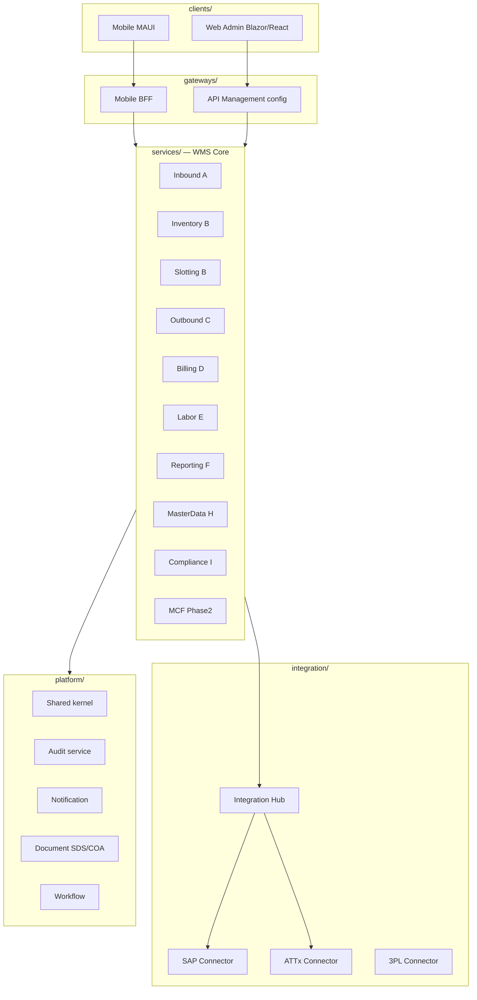

Your repo is documentation-heavy today (`docs/flows-*`, SRS, state machines) with no application code yet. Below is a **detailed project structure for Option A (Microsoft-aligned)** that matches the architecture in `docs/Architectural/architectural.md`, maps to modules A–I + MCF, and is practical for a .NET/AKS delivery team.

---

## 1. Repository strategy

| Approach | Recommendation |
|----------|----------------|
| **Primary repo** | Single **monorepo** `syngenta-wms` — shared contracts, CI, infra, and cross-service refactors stay simple |
| **Exceptions** | Separate repo only for **AI training artifacts** (large datasets) and optionally **escrow mirror** (quarterly sync) |
| **Solution style** | One `.sln` per deployable area + one **root meta-solution** for local full-stack dev |

```text
syngenta-wms/
├── .github/                    # CI/CD workflows
├── .azure/                     # Azure DevOps pipelines (if used alongside GitHub)
├── docs/                         # ← keep your existing Syngenta docs here
├── deploy/                     # Bicep/Terraform, Helm, env configs
├── tools/                      # Scripts, codegen, local dev helpers
├── src/                        # All application code
├── tests/                      # Cross-cutting test suites
├── Directory.Build.props         # Shared .NET settings
├── Directory.Packages.props      # Central NuGet version management
├── global.json                   # Pin .NET SDK
├── Syngenta.Wms.sln              # Root solution (all projects)
├── nuget.config
├── .editorconfig
└── README.md
```

---

## 2. High-level `src/` layout

```text
src/
├── platform/                   # Cross-cutting platform libraries & hosts
├── services/                   # WMS bounded-context microservices
├── integration/                # Integration Hub (SAP, ATTx, 3PL)
├── ai/                         # AI Vision edge + cloud MLOps
├── clients/                    # Web admin, mobile, edge UI
├── gateways/                   # API Gateway, BFFs
└── workers/                    # Background jobs, schedulers, CDC
```



---

## 3. Platform layer (`src/platform/`)

Shared libraries and horizontal services used by all modules.

```text
src/platform/
├── Syngenta.Wms.Shared/
│   ├── Domain/                 # Base entities, value objects, Result<T>, enums
│   ├── Events/                 # Domain event base types
│   ├── Exceptions/
│   ├── Extensions/
│   └── Constants/              # Warehouse codes, phase flags
│
├── Syngenta.Wms.Contracts/     # Public DTOs, integration messages, OpenAPI schemas
│   ├── Inbound/
│   ├── Inventory/
│   ├── Outbound/
│   ├── Integration/            # INT-01..INT-12 message contracts
│   ├── Events/                 # CloudEvents / Service Bus payloads
│   └── Mobile/                 # BFF request/response shapes
│
├── Syngenta.Wms.Application/   # Shared application abstractions
│   ├── Behaviors/              # MediatR pipeline: validation, audit, idempotency
│   ├── Interfaces/
│   └── Outbox/                 # Outbox pattern interfaces
│
├── Syngenta.Wms.Infrastructure/
│   ├── Persistence/            # EF Core base DbContext, interceptors
│   ├── Caching/                # Azure Redis wrappers
│   ├── Messaging/              # Azure Service Bus publisher/subscriber
│   ├── Storage/                # Azure Blob (labels, SDS, COA)
│   ├── Security/               # JWT validation, RBAC claims mapping
│   ├── Telemetry/              # OpenTelemetry → Azure Monitor
│   ├── FeatureFlags/           # Azure App Configuration
│   └── Localization/           # vi-VN / en-US resources
│
├── Syngenta.Wms.Audit/
│   ├── Syngenta.Wms.Audit.Api/
│   ├── Syngenta.Wms.Audit.Application/
│   ├── Syngenta.Wms.Audit.Domain/      # Immutable audit entries (7-year)
│   └── Syngenta.Wms.Audit.Infrastructure/
│
├── Syngenta.Wms.Notification/
│   ├── Syngenta.Wms.Notification.Api/
│   ├── Syngenta.Wms.Notification.Worker/ # SMTP, Teams webhooks (INT-12)
│   └── ...Application / Domain / Infrastructure
│
├── Syngenta.Wms.Document/
│   ├── Syngenta.Wms.Document.Api/        # SDS upload, COA OCR trigger
│   ├── Syngenta.Wms.Document.Worker/   # Azure AI Document Intelligence OCR
│   └── ...
│
└── Syngenta.Wms.Workflow/
    ├── Syngenta.Wms.Workflow.Api/       # Approval APIs (QA hold, recount, variance)
    └── Syngenta.Wms.Workflow.Functions/ # Azure Durable Functions orchestrations
```

**Microsoft stack mapping**

| Component | Azure service |
|-----------|---------------|
| Cache | Azure Cache for Redis |
| Messaging | Azure Service Bus (+ optional Event Hubs for analytics CDC) |
| Files | Azure Blob Storage |
| Secrets | Azure Key Vault + Managed Identity |
| Feature flags | Azure App Configuration |
| OCR (COA) | Azure AI Document Intelligence |
| Observability | Application Insights + Log Analytics |

---

## 4. WMS Core services (`src/services/`)

Each service follows **Clean Architecture** with the same internal shape:

```text
Syngenta.Wms.{ServiceName}/
├── Syngenta.Wms.{ServiceName}.Api/           # ASP.NET Core Minimal API / Controllers
├── Syngenta.Wms.{ServiceName}.Application/   # Commands, queries, handlers (MediatR)
├── Syngenta.Wms.{ServiceName}.Domain/        # Aggregates, domain rules, events
├── Syngenta.Wms.{ServiceName}.Infrastructure/  # EF repos, external adapters
└── Dockerfile
```

### 4.1 Module mapping

```text
src/services/
│
├── inbound/                              # Module A — Phase 1
│   └── Syngenta.Wms.Inbound.*
│       # Production AI receipt, pallet consolidation, external inbound,
│       # manual review queue, COA verification hooks
│
├── inventory/                            # Module B (core)
│   └── Syngenta.Wms.Inventory.*
│       # Bin-level stock, digital map, cycle count, stocktake reconciliation
│
├── slotting/                             # Module B (optimization)
│   └── Syngenta.Wms.Slotting.*
│       # Put-away rules, FEFO/FIFO, hazard matrix enforcement, route graph
│
├── outbound/                             # Module C — Phase 1
│   └── Syngenta.Wms.Outbound.*
│       # SO/DN tasks, GPD scan, multi-level pallet/case, PGI-ready state
│
├── billing/                              # Module D
│   └── Syngenta.Wms.Billing.*
│       # 3PL rate cards, utilization, invoice reconcile, variance workflow
│
├── labor/                                # Module E — Bien Hoa only
│   └── Syngenta.Wms.Labor.*
│       # Roster, shifts, MHE catalog, forklift hours, PM schedules
│
├── reporting/                            # Module F (API layer; BI separate)
│   └── Syngenta.Wms.Reporting.*
│       # KPI API feeds, scheduled report jobs, export orchestration
│
├── masterdata/                           # Module H
│   └── Syngenta.Wms.MasterData.*
│       # Warehouse zones, materials cache, hazard config UI backend
│
├── compliance/                           # Module I
│   └── Syngenta.Wms.Compliance.*
│       # Chemical register, GHS label data, MRL checks, incident/PPE logs
│
└── mcf/                                  # Phase 2 — feature-flagged
    └── Syngenta.Wms.Mcf.*
        # MCF-01..07: auto GR, PM BOM, bulk tanks, yield, line clearance
```

### 4.2 Per-service folder conventions (example: `Inbound`)

```text
Syngenta.Wms.Inbound.Application/
├── Commands/
│   ├── ConfirmAiPalletReceipt/
│   │   ├── ConfirmAiPalletReceiptCommand.cs
│   │   ├── ConfirmAiPalletReceiptHandler.cs
│   │   └── ConfirmAiPalletReceiptValidator.cs
│   └── ...
├── Queries/
├── EventHandlers/              # React to Integration Hub / AI events
├── Services/                   # Domain services (consolidation, label payload)
└── Mappings/

Syngenta.Wms.Inbound.Domain/
├── Aggregates/
│   ├── ProductionReceipt/
│   ├── PalletLabel/
│   └── ManualReviewQueueItem/
├── Rules/
├── Events/
│   └── PalletVerifiedEvent.cs
└── Repositories/               # Interfaces only

Syngenta.Wms.Inbound.Infrastructure/
├── Persistence/
│   ├── InboundDbContext.cs
│   ├── Configurations/
│   └── Migrations/
├── Integrations/
│   ├── AiVisionResultConsumer.cs
│   └── LabelPrintAdapter.cs
└── Outbox/
    └── InboundOutboxProcessor.cs
```

**Database strategy:** One **PostgreSQL database per service** (schema isolation) on Azure Database for PostgreSQL Flexible Server — aligns with independent upgrades and 1-week warehouse onboarding via config, not schema forks.

---

## 5. Integration Hub (`src/integration/`)

Dedicated area — not embedded in domain services.

```text
src/integration/
├── Syngenta.Wms.Integration.Hub/
│   ├── Syngenta.Wms.Integration.Hub.Api/       # Admin: replay, health, message log
│   ├── Syngenta.Wms.Integration.Hub.Worker/    # Schedulers, consumers, outbox dispatch
│   ├── Syngenta.Wms.Integration.Hub.Domain/    # Message log, idempotency, heartbeat
│   └── Syngenta.Wms.Integration.Hub.Infrastructure/
│
├── connectors/
│   ├── Syngenta.Wms.Integration.Sap/
│   │   ├── Adapters/
│   │   │   ├── Int01MasterDataSync/
│   │   │   ├── Int02ProductionOrder/           # Phase 2
│   │   │   ├── Int03SalesDelivery/
│   │   │   └── Int04GoodsMovement/             # Phase 2 PGI/GR/IDoc
│   │   ├── Mapping/                            # SAP ↔ WMS field maps
│   │   └── SapConnectorOptions.cs
│   │
│   ├── Syngenta.Wms.Integration.Attx/
│   │   ├── AttxSequenceValidator.cs
│   │   └── AttxOAuthClient.cs
│   │
│   └── Syngenta.Wms.Integration.ThirdPartyLogistics/
│       ├── MekongAdapter/
│       ├── AsgNorthAdapter/
│       └── BillingSnapshotImporter/
│
├── logicapps/                  # Azure Logic Apps ARM/Bicep + workflow JSON (optional SAP CPI bridge)
│   ├── int01-nightly-full-sync/
│   └── int-health-heartbeat/
│
└── schemas/                    # JSON Schema / XSD for IDoc & API payloads
    ├── sap/
    ├── attx/
    └── wms-events/
```

**Phase flags** live in Integration Hub config (`auto_pgi`, `auto_gr`, `mcf_enabled`) — not scattered across services.

---

## 6. AI Vision (`src/ai/`)

Split **edge runtime** (Python/C++ on Jetson) from **cloud MLOps** (.NET orchestration + Python training).

```text
src/ai/
├── edge/
│   ├── syngenta-vision-edge/           # Python package (DeepStream / GStreamer)
│   │   ├── pipeline/
│   │   │   ├── capture_rtsp.py
│   │   │   ├── layer_trigger.py
│   │   │   ├── qr_decode.py
│   │   │   ├── carton_count.py
│   │   │   └── defect_detect.py
│   │   ├── inference/
│   │   │   ├── tensorrt_engine/
│   │   │   └── models/                 # .engine / .onnx (not large weights in git)
│   │   ├── api/
│   │   │   └── fastapi_server.py       # INT-06 → WMS Inbound
│   │   ├── buffer/
│   │   │   └── local_redis_queue.py
│   │   ├── config/
│   │   │   └── lines/                  # Per-line camera profiles (KL vs Cup vs Sachet)
│   │   ├── docker/
│   │   │   └── Dockerfile.jetson
│   │   └── tests/
│   │
│   └── deploy/
│       ├── docker-compose.edge.yml
│       └── k3s/                        # Optional edge K8s manifests
│
├── cloud/
│   ├── Syngenta.Wms.AiVision.Orchestrator/   # .NET — model deploy, edge health, metrics
│   │   ├── Syngenta.Wms.AiVision.Api/
│   │   └── Syngenta.Wms.AiVision.Worker/
│   │
│   └── mlops/                          # Python — training & registry
│       ├── datasets/                   # .gitignore; stored in Azure Blob
│       ├── training/
│       │   ├── train_yolo.py
│       │   ├── export_tensorrt.py
│       │   └── explainability/         # Grad-CAM scripts
│       ├── pipelines/                  # Azure ML pipeline YAML
│       ├── registry/                   # Model version manifest
│       └── notebooks/
│
└── contracts/
    └── vision-result-v1.json           # Shared schema: edge ↔ WMS Inbound
```

**Video retention:** Edge NAS mount configured in `edge/deploy/` — not in cloud Blob unless metadata-only.

---

## 7. Clients (`src/clients/`)

```text
src/clients/
├── web/
│   ├── Syngenta.Wms.Web.Admin/         # Blazor Web App or React + Vite
│   │   ├── Pages/
│   │   │   ├── MasterData/             # Module H
│   │   │   ├── WarehouseMap/           # Module B
│   │   │   ├── Dashboards/             # Module F embed
│   │   │   ├── Compliance/             # Module I admin
│   │   │   ├── Billing/                # Module D
│   │   │   └── Integration/            # Hub health, replay UI
│   │   ├── Components/
│   │   ├── Resources/                  # vi-VN, en-US (.resx or i18n JSON)
│   │   └── wwwroot/
│   │
│   └── Syngenta.Wms.Web.Reporting/     # Power BI Embedded host page (optional split)
│
├── mobile/
│   └── Syngenta.Wms.Mobile/            # .NET MAUI
│       ├── Views/                      # Vietnamese-primary UI
│       │   ├── Inbound/
│       │   ├── Putaway/
│       │   ├── Picking/
│       │   ├── CycleCount/
│       │   └── SdsLookup/
│       ├── ViewModels/
│       ├── Services/
│       │   ├── ApiClient/
│       │   ├── OfflineStore/           # SQLite outbox (30-min offline)
│       │   └── SyncEngine/             # 5-min reconcile on reconnect
│       ├── Platforms/
│       │   ├── Android/                # Primary RF device target
│       │   └── Windows/                # Optional supervisor tablet
│       └── Resources/
│
└── print/
    └── Syngenta.Wms.Print.Agent/       # Small Windows/Linux service: ZPL + GHS label render
```

**Auth:** MSAL → Azure AD; admin MFA enforced via Conditional Access (not app code alone).

---

## 8. Gateways & BFF (`src/gateways/`)

```text
src/gateways/
├── Syngenta.Wms.Api.Gateway/           # YARP reverse proxy OR APIM policy repo
│   ├── appsettings.Routes.json
│   └── Middleware/                     # Rate limit, correlation ID
│
└── Syngenta.Wms.Mobile.Bff/            # Aggregates mobile calls; offline sync endpoint
    ├── Endpoints/
    │   ├── SyncBatch/
    │   ├── TaskInbox/
    │   └── ScanSubmit/
    └── Aggregation/
```

**Production:** Azure API Management in front of AKS ingress; gateway project mainly for **local dev** and **policy-as-code** export.

---

## 9. Background workers (`src/workers/`)

```text
src/workers/
├── Syngenta.Wms.Worker.Scheduler/      # Hangfire or Azure Functions timer triggers
│   # 15-min SAP delta, nightly full sync triggers, report schedules, PM alerts
│
├── Syngenta.Wms.Worker.Cdc/            # Debezium → Event Hubs OR PostgreSQL logical replication
│   # Feeds analytics / Power BI dataset refresh
│
└── Syngenta.Wms.Worker.IoT/            # Azure IoT Hub → Service Bus (INT-09 optional)
```

---

## 10. Infrastructure (`deploy/`)

```text
deploy/
├── bicep/                              # Primary IaC (Microsoft-aligned)
│   ├── main.bicep
│   ├── modules/
│   │   ├── aks.bicep
│   │   ├── postgres.bicep
│   │   ├── redis.bicep
│   │   ├── servicebus.bicep
│   │   ├── keyvault.bicep
│   │   ├── storage.bicep
│   │   ├── apim.bicep
│   │   ├── appconfig.bicep
│   │   ├── iothub.bicep                # Optional
│   │   ├── monitor.bicep
│   │   └── frontdoor.bicep             # Optional WAF
│   └── parameters/
│       ├── dev.bicepparam
│       ├── uat.bicepparam
│       └── prod-vn.bicepparam          # VN or SG region lock
│
├── helm/
│   ├── syngenta-wms/                   # Umbrella chart
│   │   ├── Chart.yaml
│   │   ├── values.yaml
│   │   ├── values-dev.yaml
│   │   └── templates/
│   └── services/                       # Subcharts per microservice
│       ├── inbound/
│       ├── integration-hub/
│       └── ...
│
├── environments/
│   ├── dev/
│   ├── uat/
│   └── prod/
│
├── docker/
│   └── docker-compose.yml              # Local stack: Postgres, Redis, Service Bus emulator
│
└── runbooks/
    ├── dr-failover.md
    └── sap-outage.md
```

---

## 11. Tests (`tests/`)

```text
tests/
├── unit/
│   ├── Syngenta.Wms.Inbound.UnitTests/
│   ├── Syngenta.Wms.Slotting.UnitTests/    # Hazard matrix, FEFO rules
│   └── ...
│
├── integration/
│   ├── Syngenta.Wms.IntegrationTests/      # Testcontainers: Postgres, Redis
│   ├── Syngenta.Wms.Sap.IntegrationTests/  # SAP mock / SAP CI sandbox
│   └── Syngenta.Wms.Api.IntegrationTests/
│
├── contract/
│   └── Pact/                               # Mobile BFF ↔ services, Hub ↔ SAP
│
├── e2e/
│   ├── Syngenta.Wms.E2E.Playwright/        # Web admin flows
│   └── scenarios/                          # Gherkin: inbound AI fallback, pick scan
│
├── performance/
│   └── k6/                                 # P95 <3s, 50 users, 20 scanners
│
└── ai/
    ├── vision-accuracy/                    # 7-day rolling accuracy gate ≥99%
    └── benchmark/                          # <3s/image, <30s/pallet
```

---

## 12. DevOps & tooling

```text
.github/
├── workflows/
│   ├── ci-build-test.yml
│   ├── ci-docker-publish.yml
│   ├── deploy-aks-dev.yml
│   ├── deploy-aks-prod.yml               # Manual approval gate
│   ├── db-migrate.yml                    # EF migrations per service
│   ├── ai-model-promote.yml              # Azure ML → edge registry
│   └── docs-validate.yml                 # Your existing validate-flows.mjs
│
tools/
├── scripts/
│   ├── new-service.ps1                   # Scaffolds Clean Architecture project
│   ├── seed-masterdata/
│   └── warehouse-onboard/                # 1-week new site parameter pack
├── openapi/
│   └── merge-specs.ps1
└── local/
    └── aspire/                           # Optional: .NET Aspire AppHost for dev
        └── Syngenta.Wms.AppHost/
```

**Local dev (recommended):** `.NET Aspire` AppHost spinning Postgres, Redis, Service Bus emulator, and selected APIs — faster onboarding than full AKS locally.

---

## 13. Documentation alignment (existing `docs/`)

Keep specification and flows where they are; add code-adjacent docs:

```text
docs/
├── Architectural/
│   └── architectural.md                # ← you have this
├── adr/                                # Architecture Decision Records
│   ├── 001-monorepo.md
│   ├── 002-postgres-per-service.md
│   └── 003-outbox-servicebus.md
├── api/                                # Generated OpenAPI snapshots per service
├── runbooks/                           # Ops (mirror deploy/runbooks in prose)
├── flows-a/ ... flows-i/               # ← existing
└── onboarding/
    ├── dev-setup.md
    └── service-ownership.md
```

---

## 14. Solution file organization

```text
Syngenta.Wms.sln
├── solution folders/
│   ├── 01-Platform
│   ├── 02-Services-Inbound
│   ├── 02-Services-Inventory
│   ├── 02-Services-Outbound
│   ├── 02-Services-CrossModule
│   ├── 03-Integration
│   ├── 04-AI
│   ├── 05-Clients
│   ├── 06-Gateways
│   ├── 07-Workers
│   └── 99-Tests
```

Smaller teams can use **nested solutions**:

- `Syngenta.Wms.Core.sln` — services + platform  
- `Syngenta.Wms.Integration.sln` — hub + connectors  
- `Syngenta.Wms.Clients.sln` — web + mobile  

---

## 15. Team ownership (recommended)

| Squad | Owns |
|-------|------|
| **Platform** | `platform/`, `gateways/`, `deploy/`, shared CI |
| **Execution** | `inbound`, `inventory`, `slotting`, `outbound`, mobile BFF |
| **Integration** | `integration/`, SAP/ATTx/3PL, Phase flags |
| **Compliance & QA** | `compliance`, `document`, workflow approvals |
| **AI** | `ai/edge`, `ai/cloud/mlops`, Inbound AI hooks |
| **Analytics** | `reporting`, CDC worker, Power BI datasets |
| **MCF (Phase 2)** | `mcf/` + INT-02/04 activation |

---

## 16. Phase 1 vs Phase 2 in the tree

| Phase 1 (go-live) | Phase 2 (add without restructure) |
|-------------------|-------------------------------------|
| All services except `mcf/` | Enable `services/mcf/` |
| `integration/connectors/Sap/Int01`, `Int03` | Add `Int02`, `Int04` folders |
| `ai/edge` full rollout | Same; optional auto-GR hook in Inbound |
| Feature flag `AutoPgi=false` | Flip in App Configuration |

---

## 17. Naming & package conventions

| Item | Convention |
|------|------------|
| **Namespaces** | `Syngenta.Wms.{Area}.{Layer}` |
| **API routes** | `/api/v1/{warehouseId}/inbound/...` |
| **Service Bus topics** | `wms.inbound.events`, `wms.integration.sap` |
| **Docker images** | `syngentacr.azurecr.io/wms/inbound:1.2.3` |
| **Helm release** | `wms-inbound` per microservice |
| **Config keys** | `Wms:Integration:Sap:Int03:Enabled` |
| **DB migration** | `{Service}.Infrastructure/Migrations/` |

---

## 18. Minimal “Day 1” scaffold order

If you want a pragmatic bootstrap sequence:

1. `platform/` — Shared, Contracts, Infrastructure, Audit  
2. `integration/` — Hub skeleton + SAP INT-01 mock  
3. `services/masterdata` + `services/inventory` — warehouse map, locations  
4. `gateways/Mobile.Bff` + `clients/mobile` — offline sync proof  
5. `services/inbound` + `ai/edge` POC  
6. `services/outbound` + INT-03  
7. Remaining modules + `deploy/bicep` prod path  

---

This structure keeps **Option A** consistent end-to-end: ASP.NET Core microservices on AKS, Azure PostgreSQL/Redis/Service Bus/Blob/Key Vault/App Configuration, Azure AD + MSAL, Logic Apps or SAP CPI at the integration edge, Azure ML for retraining, Power BI for Module F, and MAUI for Vietnamese floor UX with offline sync.

If you want next steps, I can expand any one slice—for example the **exact OpenAPI surface per service**, **Service Bus topic/event catalog**, or **Bicep module dependency graph**—still in Ask mode as design guidance only. Switch to Agent mode if you want this scaffold written into the repo.