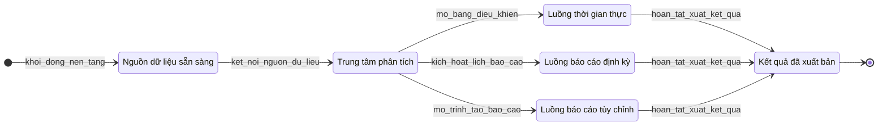

# 00 — Tổng quan Mô-đun F

**Yêu cầu liên quan:** FR-F01, FR-F02, FR-F05, FR-F06, FR-F07

Luồng tổng quan từ nguồn dữ liệu qua trung tâm phân tích đến các đầu ra thời gian thực, định kỳ và tùy chỉnh.

## Bảng trạng thái

| ID | Nhãn tiếng Việt | Mô tả |
|----|-----------------|-------|
| `NguonDuLieuSanSang` | Nguồn dữ liệu sẵn sàng | Giao dịch WMS, dữ liệu chủ SAP (INT-01), log AI Vision, bảng chi phí 3PL đã sẵn sàng. |
| `TrungTamPhanTich` | Trung tâm phân tích | Điểm vào Mô-đun F; định tuyến đến luồng thời gian thực, định kỳ hoặc tùy chỉnh. |
| `LuongThoiGianThuc` | Luồng thời gian thực | Bảng điều khiển KPI trực tiếp (biểu đồ 01); gồm bảng 3PL/nhân lực (biểu đồ 03). |
| `LuongBaoCaoDinhKy` | Luồng báo cáo định kỳ | Báo cáo vận hành hàng ngày và quản trị hàng tuần (biểu đồ 02). |
| `LuongBaoCaoTuyChinh` | Luồng báo cáo tùy chỉnh | Trình tạo báo cáo và xuất dữ liệu (biểu đồ 04). |
| `KetQuaDaXuatBan` | Kết quả đã xuất bản | Hiển thị UI, gửi email hoặc xuất file hoàn tất. |

## Ghi chú

- Biểu đồ chi tiết: [01-bang-dieu-khien-thoi-gian-thuc.md](./01-bang-dieu-khien-thoi-gian-thuc.md), [02-bao-cao-dinh-ky.md](./02-bao-cao-dinh-ky.md), [03-bang-dieu-khien-chuyen-biet.md](./03-bang-dieu-khien-chuyen-biet.md), [04-trinh-tao-bao-cao-xuat.md](./04-trinh-tao-bao-cao-xuat.md)
- Đặc tả tiếng Anh: [Module_F_State_Machines.md](../../Module_F_State_Machines.md)
