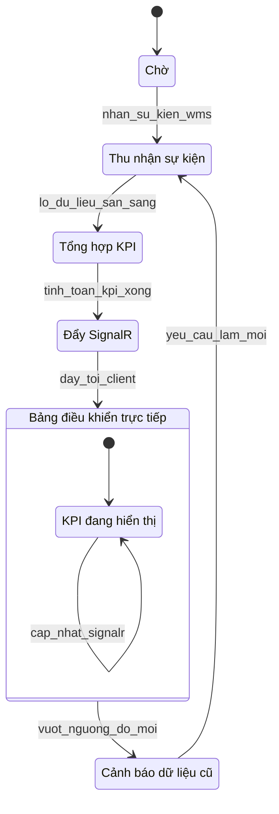

# 01 — Bảng điều khiển thời gian thực

**Yêu cầu liên quan:** FR-F01, FR-F07

Vòng đời KPI trực tiếp qua SignalR (ASP.NET Core + Blazor + SQL Server).

## Bảng trạng thái

| ID | Nhãn tiếng Việt | Mô tả | FR |
|----|-----------------|-------|-----|
| `Cho` | Chờ | Không có lô thu thập dữ liệu đang chạy. | — |
| `ThuNhanSuKien` | Thu nhận sự kiện | Tiêu thụ luồng sự kiện WMS, đồng bộ SAP, log AI Vision. | F01 |
| `TongHopKPI` | Tổng hợp KPI | Tổng hợp chỉ số KPI trên SQL Server. | F01 |
| `DaySignalR` | Đẩy SignalR | Đẩy cập nhật tới client Blazor đã kết nối. | F01 |
| `BangDieuKhienTrucTiep` | Bảng điều khiển trực tiếp | Người dùng xem ô KPI trực tiếp; giao diện responsive (F07). | F01, F07 |
| `KPIDangHienThi` | KPI đang hiển thị | Trạng thái con; ô KPI cập nhật qua SignalR. | F01 |
| `CanhBaoDuLieuCu` | Cảnh báo dữ liệu cũ | Vượt ngưỡng độ mới dữ liệu; kích hoạt làm mới. | NFR |

## KPI bắt buộc (FR-F01)

- Mức tồn kho theo khu vực và vị trí
- Hạn sử dụng còn lại của lô; cảnh báo cận hạn
- Thông lượng theo ca/ngày (pallet/giờ)
- Độ chính xác picking và kiểm đếm
- Mức sử dụng kho (%)
- Tỷ lệ tuân thủ FEFO
- Độ chính xác AI Vision (mục tiêu ≥99%)

## Ghi chú

- Hiệu năng: thời gian tải P95 ≤ 3 giây; ≥50 người dùng đồng thời (NFR).
- Bảng chuyên biệt: [03-bang-dieu-khien-chuyen-biet.md](./03-bang-dieu-khien-chuyen-biet.md)
