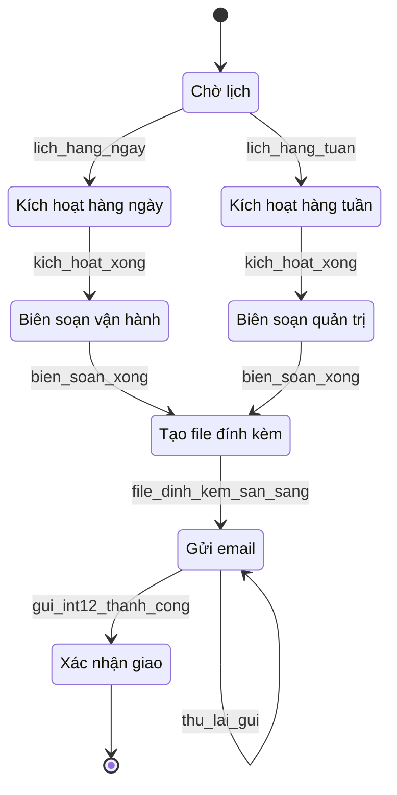

# 02 — Báo cáo vận hành và quản trị định kỳ

**Yêu cầu liên quan:** FR-F02, FR-F06, INT-12

Biên soạn và phân phối báo cáo tự động qua email (tích hợp INT-12).

## Bảng trạng thái

| ID | Nhãn tiếng Việt | Mô tả | FR |
|----|-----------------|-------|-----|
| `ChoLich` | Chờ lịch | Bộ lập lịch chờ cửa sổ hàng ngày hoặc hàng tuần. | F02 |
| `KichHoatHangNgay` | Kích hoạt hàng ngày | Cron báo cáo vận hành được kích hoạt. | F02 |
| `KichHoatHangTuan` | Kích hoạt hàng tuần | Cron báo cáo quản trị được kích hoạt. | F02 |
| `BienSoanVanHanh` | Biên soạn vận hành | Tổng hợp chỉ số vận hành hàng ngày. | F02 |
| `BienSoanQuanTri` | Biên soạn quản trị | Tổng hợp báo cáo quản lý hàng tuần. | F02 |
| `TaoFileDinhKem` | Tạo file đính kèm | Xuất báo cáo dạng Excel hoặc PDF. | F02, F06 |
| `GuiEmail` | Gửi email | INT-12 gửi email; thử lại khi thất bại. | F02, INT-12 |
| `XacNhanGiao` | Xác nhận giao | Email đã giao; công việc hoàn tất. | F02 |

## Ghi chú

- **INT-12:** WMS → Email/MS Teams (SMTP/webhook), Giai đoạn 1.
- Tần suất: báo cáo vận hành **hàng ngày**; báo cáo quản trị **hàng tuần** (FR-F02).
