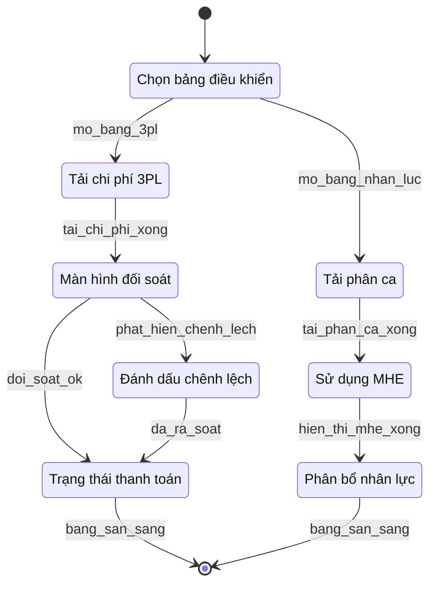

# 03 — Bảng điều khiển chuyên biệt

**Yêu cầu liên quan:** FR-F03, FR-F04

Lớp trình bày chi phí 3PL (Mô-đun D) và KPI nhân lực/thiết bị tại Biên Hòa (Mô-đun E).

## Bảng trạng thái

| ID | Nhãn tiếng Việt | Phạm vi | FR |
|----|-----------------|---------|-----|
| `ChonBangDieuKhien` | Chọn bảng điều khiển | Người dùng chọn bảng chi phí 3PL hoặc nhân lực/thiết bị. | F03, F04 |
| `TaiChiPhi3PL` | Tải chi phí 3PL | Mekong và ASG-North; dữ liệu từ Mô-đun D. | F03 |
| `ManHinhDoiSoat` | Màn hình đối soát | So sánh chi phí hệ thống tính vs hóa đơn 3PL. | F03 |
| `DanhDauChenhLech` | Đánh dấu chênh lệch | Làm nổi bật sai lệch thanh toán cần rà soát. | F03 |
| `TrangThaiThanhToan` | Trạng thái thanh toán | Tóm tắt ngân sách và trạng thái chi trả. | F03 |
| `TaiPhanCa` | Tải phân ca | Kho Biên Hòa; dữ liệu phân ca từ Mô-đun E. | F04 |
| `SuDungMHE` | Sử dụng MHE | Tỷ lệ sử dụng thiết bị xếp dỡ theo ca. | F04 |
| `PhanBoNhanLuc` | Phân bổ nhân lực | Phân bổ nhân sự theo ca. | F04 |

## Ghi chú

- **FR-F03:** Không mô hình hóa lại quy trình thanh toán Mô-đun D — chỉ hiển thị kết quả đối soát.
- **FR-F04:** Chỉ áp dụng kho **Biên Hòa**; **loại trừ** KPI năng suất từng nhân viên.
