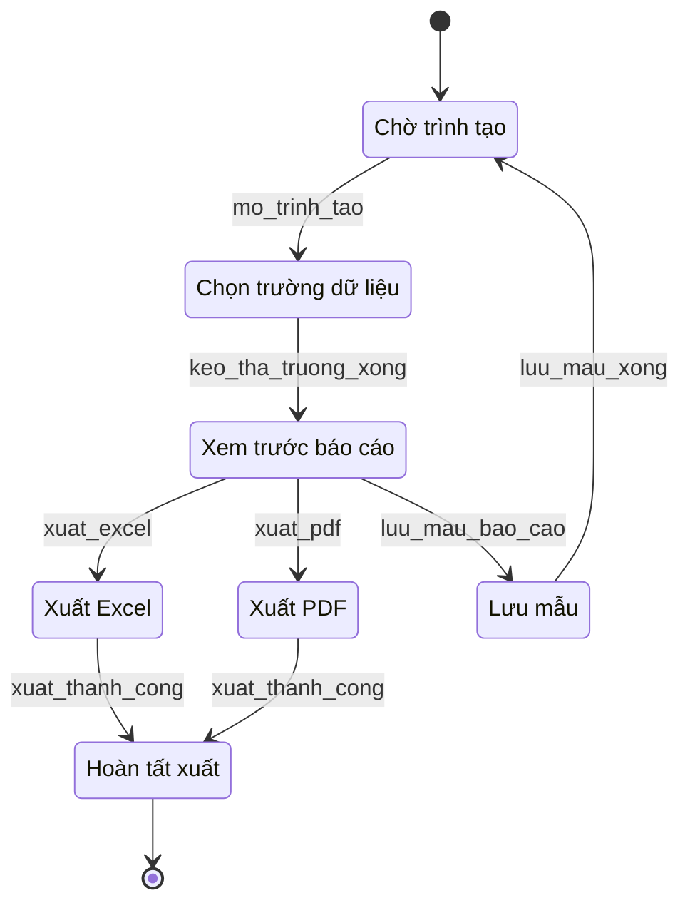

# 04 — Trình tạo báo cáo và xuất dữ liệu

**Yêu cầu liên quan:** FR-F05, FR-F06, FR-F07

Công cụ kéo-thả, xuất Excel/PDF và giao diện responsive cho máy tính bảng.

## Bảng trạng thái

| ID | Nhãn tiếng Việt | Mô tả | FR |
|----|-----------------|-------|-----|
| `ChoTrinhTao` | Chờ trình tạo | Không có phiên trình tạo báo cáo đang mở. | — |
| `ChonTruongDuLieu` | Chọn trường dữ liệu | Kéo-thả trường vào khung báo cáo. | F05 |
| `XemTruocBaoCao` | Xem trước báo cáo | Xem trước trực tiếp; layout responsive máy tính bảng 10". | F05, F07 |
| `XuatExcel` | Xuất Excel | Tải xuống định dạng Excel. | F06 |
| `XuatPDF` | Xuất PDF | Tải xuống định dạng PDF. | F06 |
| `LuuMau` | Lưu mẫu | Lưu mẫu báo cáo tùy chỉnh để tái sử dụng. | F05 |
| `HoanTatXuat` | Hoàn tất xuất | Tải file hoặc giao file xong. | F06 |

## Ghi chú

- **Bảo mật (NFR):** SSO và RBAC trước khi mở trình tạo và thao tác xuất.
- **FR-F07:** Giao diện Blazor responsive trên máy tính bảng hiện trường.
